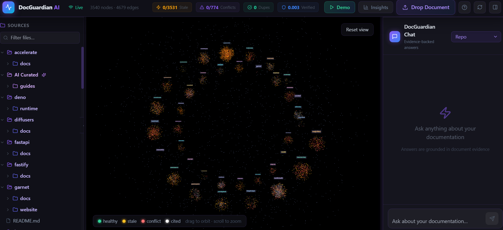
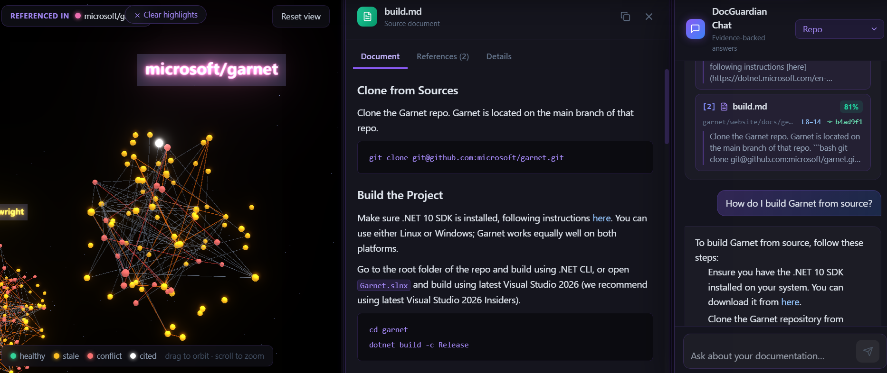
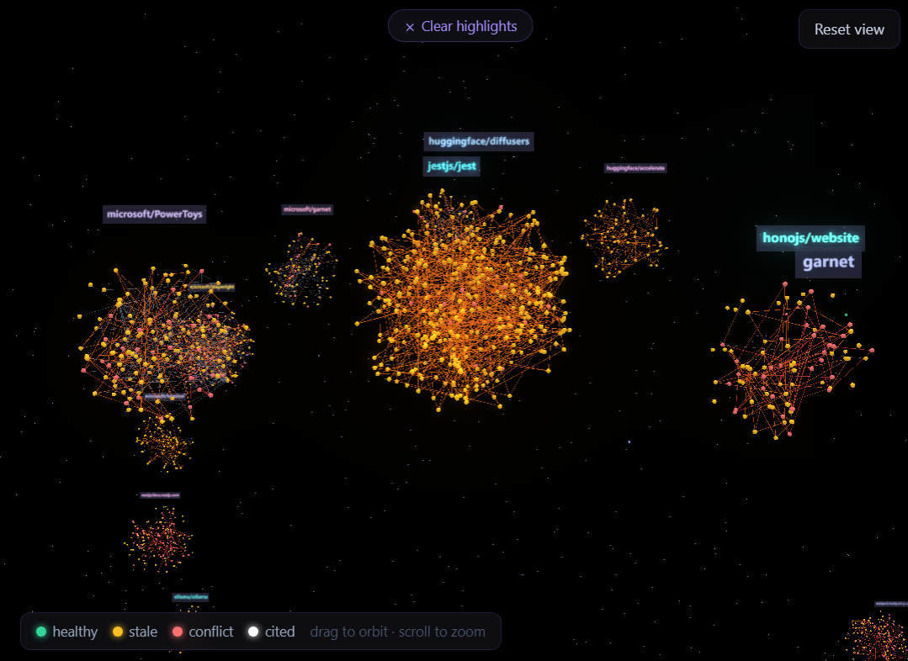
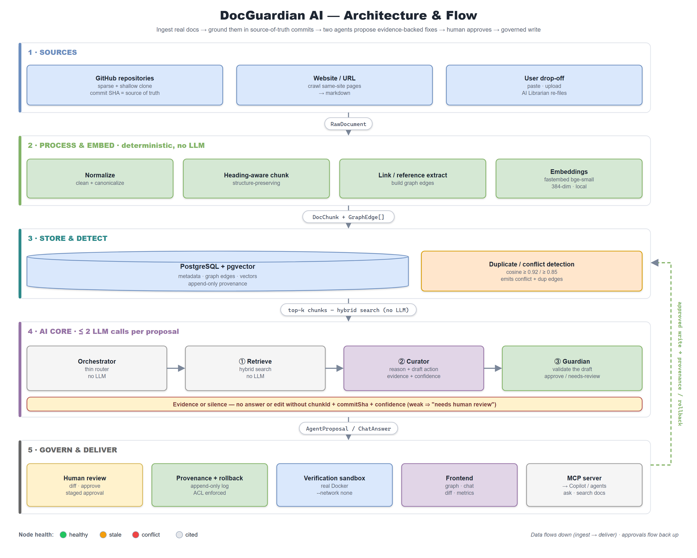
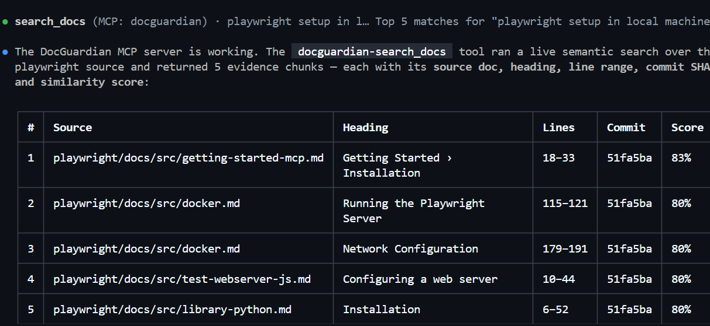
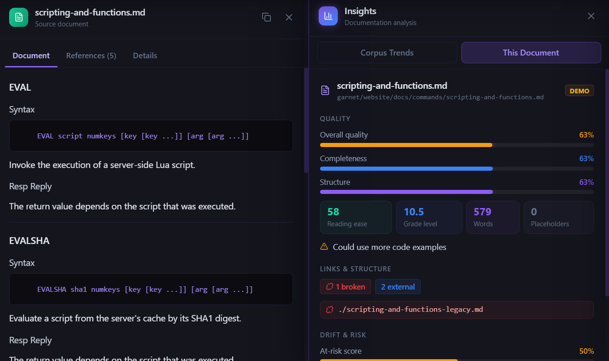

# DocGuardian AI

**AI-powered documentation governance.** DocGuardian ingests real engineering docs,
detects stale / duplicate / conflicting content, and proposes **evidence-backed**
fixes through two cooperating LLM agents — with human-in-the-loop approval,
provenance, and rollback — all on an interactive knowledge graph.

> **▶ See it in 30 seconds:** `cd frontend && npm install && npm run dev`, open
> <http://localhost:5173>, and click **Demo** — a one-click guided auto-pilot that
> plays the whole story **offline on fixtures** (no Azure, no database, no network).



*The DocGuardian workspace — a live knowledge graph of every ingested doc (color-coded by health), a source tree, stale/conflict/dupe counters, and an evidence-backed chat panel.*

---

## Problem

Engineering documentation rots:

- It goes **stale** after code, config, or process changes.
- The same process is described in **multiple, slightly conflicting** docs.
- New engineers **waste hours** searching scattered, untrustworthy pages.
- Updates are **manual and hard to review**, so nobody trusts the docs.
- Sensitive content needs **permission-aware** access and controlled edits.

The result: slower onboarding, lost productivity, and operational risk.

---

## Solution — Curator + Guardian agents

DocGuardian connects every document to its **source of truth** (repos, commits, PRs)
and runs a *thin, rule-based orchestrator* (no LLM) over **two LLM agents** plus
deterministic tools. The heavy, cheap work — search, dedup, git metadata, ACL checks,
sandbox runs — is plain code; the LLM is used only to reason and draft.

| Agent | Role |
| --- | --- |
| **Curator** | Understands the input, reasons over retrieved related docs, decides the action (create / update / merge / link / deprecate / flag), and drafts the change **with evidence + a confidence score**. |
| **Guardian** | Validates the draft: reviews verification results, checks for conflicts, and produces the **approve / needs-review** recommendation with ACL + provenance context. |

**Core invariant — evidence or silence.** No answer or edit ships without supporting
`chunkId`s, `commitSha`s, and a confidence score. Weak or missing evidence routes to
the explicit *needs human review* path. Budget: **≤2 LLM calls per proposal**
(`retrieve → curator → guardian`); the retrieve step uses no LLM.

**Worked example.** Point DocGuardian at Microsoft's **Garnet** docs and ask
*"How do I build Garnet from source?"* It surfaces the **`.NET 8` vs `.NET 6`
build conflict** between two pages, then proposes a reconciled fix — every claim
backed by the chunk and commit it came from.



*"How do I build Garnet from source?" — the answer cites the exact chunk (`build.md`, lines 8–14), its commit (`b4ad9f1`), and an 81% confidence score. No evidence, no answer.*

---

## Why not just Copilot, Obsidian, or Notion?

Those tools **read**, **link**, or **store** docs. None of them **govern** them —
continuously checking content against the source of truth, catching conflicts, and
gating every change behind human approval.

| Tool | Strength | What DocGuardian adds for *governance* |
| --- | --- | --- |
| **Copilot / RAG chatbots** | Conversational answers over your content | **Evidence-or-silence** (every claim grounded in a `chunkId` + `commitSha`), stale-vs-code detection, and governed edits — not just answers |
| **Obsidian** | A hand-built knowledge graph of notes | The graph is **auto-extracted** from ingested repos, with automatic duplicate/conflict detection and ties to source-of-truth commits |
| **Notion** | Collaborative wiki with permissions | Tells you a page is **wrong/stale/duplicated**, verifies claims in a sandbox, and keeps append-only **provenance + rollback** |

**In one line:** Copilot reads, Obsidian links, Notion stores — **DocGuardian
governs**: it detects rot, proposes evidence-backed fixes, and only writes after
human approval, with full provenance and rollback.

---

## Architecture

Five layers. Data flows **up** (ingestion → UI); approvals flow **down**
(UI → governed writes).



*The graph auto-clusters documents by source repository (Garnet, PowerToys, diffusers, jest, …) and colors every node by health: healthy, stale, conflict, or cited.*

### Architecture diagram



<details>
<summary>Text version (same five layers, ASCII)</summary>

```text
┌───────────────────────────────────────────────────────────────┐
│ 5 · FRONTEND     React + Vite · React Flow graph · chat ·      │
│                  diff/review · metrics + provenance            │
└───────────────────────────────────────────────────────────────┘
        ▲  GraphDTO / ChatAnswer / AgentProposal / MetricsDTO
┌───────────────────────────────────────────────────────────────┐
│ 4 · BACKEND/API  FastAPI REST + WebSocket · job queue ·        │
│                  Postgres store · Docker verification sandbox  │
└───────────────────────────────────────────────────────────────┘
        ▲  AgentProposal / DocChunk[] / SandboxResult
┌───────────────────────────────────────────────────────────────┐
│ 3 · AI / EMBEDDINGS  embeddings → pgvector index →             │
│                      Orchestrator → Curator → Guardian         │
└───────────────────────────────────────────────────────────────┘
        ▲  DocChunk / GraphEdge[]
┌───────────────────────────────────────────────────────────────┐
│ 2 · PROCESSING   normalize → heading-aware chunk → link/ref    │
└───────────────────────────────────────────────────────────────┘
        ▲  RawDocument
┌───────────────────────────────────────────────────────────────┐
│ 1 · INGESTION    sparse/shallow git clone + commit metadata    │
│                  (microsoft/{garnet, playwright, onnxruntime,  │
│                   vscode})                                     │
└───────────────────────────────────────────────────────────────┘
```

</details>

### Stack

- **Backend:** Python 3.11 · FastAPI · Pydantic v2 · LangGraph.
- **Storage:** one **Postgres + pgvector** instance for metadata, graph edges,
  vectors, and append-only provenance.
- **Embeddings:** local **fastembed** (`BAAI/bge-small-en-v1.5`, 384-dim) — no Azure
  needed for the ingest/retrieval path; swappable to Azure.
- **LLM agents:** **Azure OpenAI** for Curator/Guardian, with an offline
  `CHAT_PROVIDER=fake` fallback for dev/tests/demo.
- **Frontend:** React + TypeScript + Vite + Tailwind + React Flow (2D graph) + Monaco.
- **Verification:** real Docker sandbox (`--network none`, resource caps, timeout).

### Repo layout

```text
backend/   FastAPI app, agents (LangGraph), ingestion, processing, governance, storage, scripts/
frontend/  React + Vite UI (graph, chat, diff/review, metrics)
docs/      implementation-status.md (as-built, authoritative) + plans
```

---

## What works today

- **Real pipeline, not slideware.** Ingestion → chunking → embeddings → hybrid
  retrieval → duplicate/conflict detection run locally on **Postgres + pgvector**;
  the verification sandbox runs **real Docker** containers.
- **One-click guided demo** that plays fully offline (fixtures, no Azure/DB).
- **413 passing backend tests** (`pytest`, offline — no Azure or Postgres needed).
- **Extras:** an **MCP server** that exposes the corpus to Copilot CLI, **URL
  ingestion** (crawl a site → markdown → governed docs), and an AI **Librarian**
  that rewrites and re-files dropped-in docs while preserving the original.



*The same corpus is available to coding agents over **MCP**: here Copilot CLI calls `docguardian-search_docs` and gets back ranked chunks with source, heading, line range, commit, and score.*



*Deterministic-first analysis per document — quality, readability, broken links, and drift/risk — so reviewers can see why a page needs attention.*

---

## How to run

**Backend** (Python 3.11+, Docker for Postgres):

```powershell
cd backend
docker compose up -d                       # Postgres + pgvector
pip install -r requirements.txt            # first run downloads the fastembed model

# Local pipeline — no Azure needed:
python -m scripts.run_ingest --all         # clone → chunk → JSONL
python -m scripts.load_vectors --all       # embed → pgvector
python -m scripts.detect_conflicts --all   # duplicate / conflict edges
python -m scripts.search "how do I build garnet"

uvicorn app.main:app --reload --port 8000  # API + Swagger at /docs
```

The `/chat` and `/propose` agent endpoints use **Azure OpenAI** by default — set
`AZURE_OPENAI_ENDPOINT`, `AZURE_OPENAI_API_KEY`, and `AZURE_OPENAI_CHAT_DEPLOYMENT`
in `backend/.env` — or run them offline with `$env:CHAT_PROVIDER="fake"`. The
verification sandbox (`POST /verify`) needs Docker running.

**Frontend** (Node):

```powershell
cd frontend
npm install
npm run dev                                # http://localhost:5173 → click "Demo"
```

Open <http://localhost:5173> and hit **Demo** for the one-click guided walkthrough.
With the backend down, the UI still runs in **demo mode** using `src/lib/fixtures.ts`;
point at a non-default API with `VITE_API_URL` (defaults to `http://localhost:8000`).

**Tests:**

```powershell
cd backend  ; python -m pytest             # offline (CHAT_PROVIDER=fake, no Azure)
cd frontend ; npm run lint ; npm run test  # tsc --noEmit + vitest
```

---

> Full as-built detail and the original long-form product spec live in
> **`docs/implementation-status.md`** (authoritative) and the planning docs under
> `docs/`. The original README spec remains in git history.
