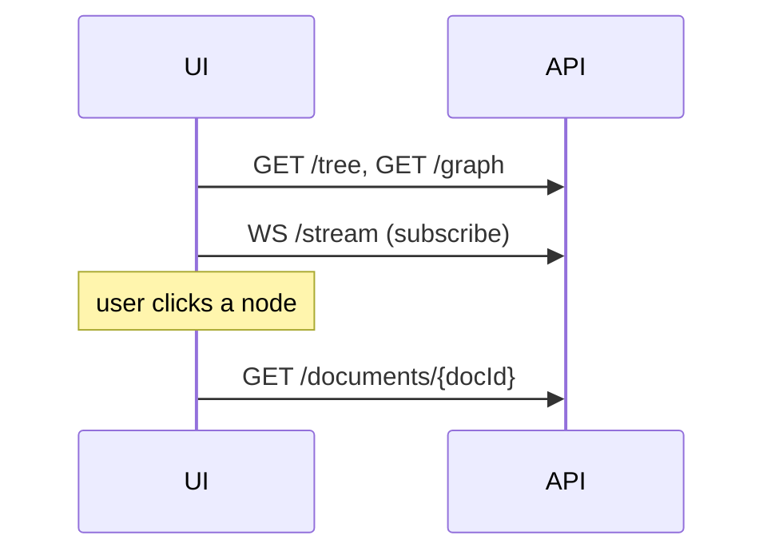
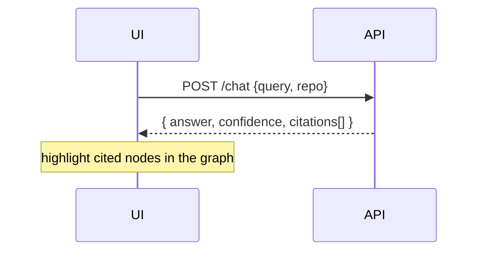
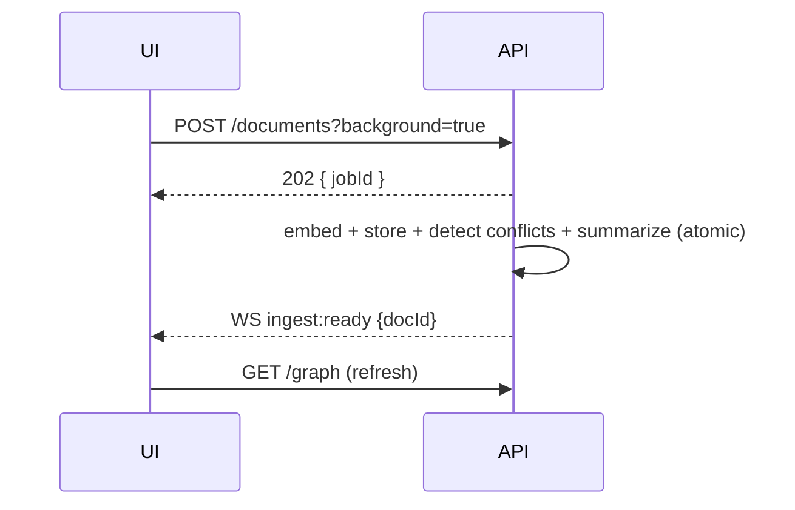
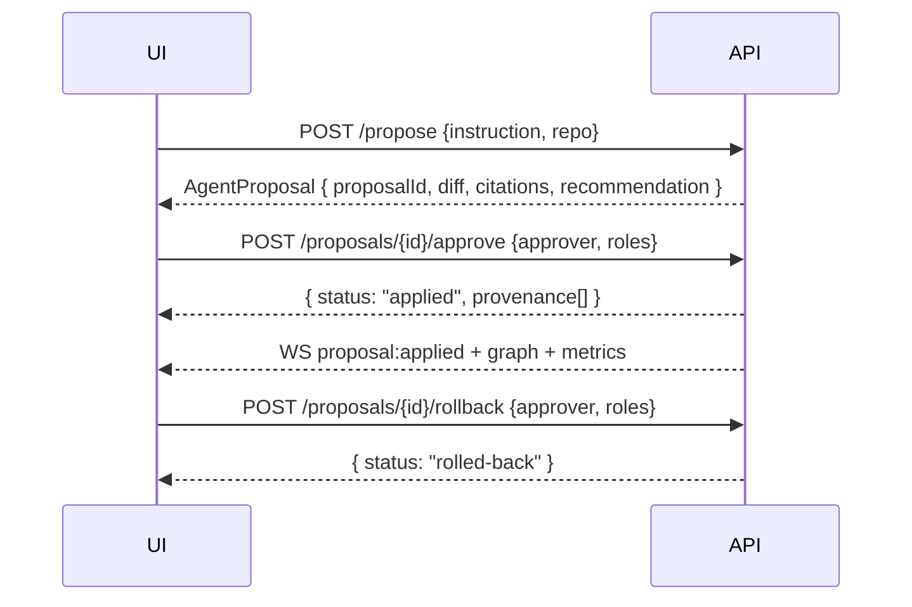

# DocGuardian AI — Backend API Reference

> **Audience:** frontend engineers wiring the UI to the backend.
> **Source of truth:** this file documents the **live, smoke-tested** API as of
> 2026-06-24. The interactive Swagger UI is at **`http://localhost:8000/docs`**
> (ReDoc at `/redoc`, raw OpenAPI at `/openapi.json`). TypeScript types for every
> shape below live in [`frontend/src/lib/types.ts`](../frontend/src/lib/types.ts);
> the typed client is [`frontend/src/lib/api.ts`](../frontend/src/lib/api.ts).

---

## 1. Basics

- **Base URL (local):** `http://localhost:8000`
- **CORS:** allows `http://localhost:5173` and `http://localhost:3000` (Vite dev).
- **Content type:** JSON in, JSON out (`application/json`).
- **Casing:** responses are **camelCase** (`docId`, `commitSha`, `lineRange`).
  The agent endpoints (`/chat`, `/propose`, `/proposals/:id`) emit **snake_case**
  internally; the typed client in `api.ts` deep-converts them to camelCase, so the
  rest of the frontend always sees camelCase.
- **Errors:** `{"detail": "<message>"}` with a standard HTTP status
  (`400/403/404/415/500`, plus `202` for staged approval and `503` when Azure is
  not configured).
- **Auth:** mocked. Governance write endpoints take an `approver` + `roles` in the
  body (no token yet).

### What needs which dependency

| Capability | Needs |
| --- | --- |
| search, tree, graph, documents, intake, metrics, verify status | Postgres + pgvector only (no cloud) |
| `/chat`, `/propose`, AI doc summaries | Azure OpenAI by default (else `503` / extractive summary), or set `CHAT_PROVIDER=fake` for a deterministic offline provider |
| `/verify` actually running a container | Docker daemon (else `available:false`) |

---

## 2. Endpoint catalog

| Method | Path | Purpose |
| --- | --- | --- |
| GET | `/health` | liveness + embedding provider/dim |
| GET | `/search?q=&repo=&k=` | semantic search |
| GET | `/tree?namespace=` | sidebar file tree (+ summaries) |
| GET | `/graph?repo=` | knowledge graph (real health/edges) |
| GET | `/documents/{docId}` | one document + its chunks (the AI-friendly rewrite) |
| GET | `/original/{docId}` | the user's original drop-off + the AI rewrite (compare) |
| POST | `/documents` | drop-off intake — **Librarian rewrites + re-files** (sync `201`, or `?background=true` → `202`+job) |
| POST | `/ingest/url` | crawl a website URL + sub-pages and import them (`202`+job) |
| GET | `/jobs/{jobId}` | async ingest job status |
| GET | `/provenance/{docId}` | append-only audit history for a doc |
| POST | `/chat` | Curator evidence-backed answer (Azure or `CHAT_PROVIDER=fake`) |
| POST | `/propose` | Curator+Guardian proposed change (Azure or fake); persisted |
| GET | `/proposals/{id}` | a persisted proposal + approval/provenance context |
| POST | `/proposals/{id}/approve` | approve + apply (writes provenance) |
| POST | `/proposals/{id}/rollback` | roll back an applied proposal |
| GET | `/metrics` | governance dashboard counters |
| POST | `/verify` | run a command in the Docker sandbox |
| WS | `/stream` | live event feed |

---

## 3. Read endpoints

### GET `/health`
```json
{ "status": "ok", "embeddingProvider": "local:BAAI/bge-small-en-v1.5", "dim": 384 }
```

### GET `/search?q=&repo=&k=`
- `q` (required), `repo` (optional shortName: `garnet|playwright|onnxruntime|vscode|user`), `k` (1–50, default 5).
```jsonc
{
  "query": "how to build garnet",
  "matches": [
    {
      "chunkId": "garnet/website/docs/getting-started/build.md#...",
      "docId": "garnet/website/docs/getting-started/build.md",
      "repo": "garnet",
      "headingPath": ["Building Garnet"],
      "text": "…",
      "lineRange": [12, 24],
      "commitSha": "4e44e3e…",
      "score": 0.8021            // cosine similarity in [0,1]
    }
  ]
}
```

### GET `/tree?namespace=`
Nested folders-then-files; **file nodes carry a one-line `summary`**.
```jsonc
[
  { "name": "garnet", "type": "folder", "path": "garnet", "children": [
    { "name": "README.md", "type": "file", "path": "garnet/README.md",
      "summary": "Garnet is a remote cache-store from Microsoft Research…" }
  ]}
]
```
> Note: the backend emits `type: "folder" | "file"`; the client normalizes
> `folder → directory` so the UI uses `directory | file`.

### GET `/graph?repo=`
Nodes carry **real** derived `health` (`green|yellow|red|gray`) and `size` (0–1);
edges include `references`, `duplicate-of`, `conflicts-with`, `deprecated-by`.
```jsonc
{
  "nodes": [
    { "id": "garnet/website/README.md", "label": "README.md",
      "health": "yellow", "size": 0.35, "accessible": true, "repo": "garnet" }
  ],
  "edges": [
    { "from": "garnet/a.md", "to": "garnet/b.md", "type": "conflicts-with", "weight": 0.88 }
  ]
}
```
> The client maps edges to React Flow shape: `from→source`, `to→target`, plus a
> synthetic stable `id`.

### GET `/documents/{docId}`
`docId` contains slashes (it is a path) — send it verbatim, e.g.
`/documents/garnet/website/README.md`. For a user drop-off the returned `chunks`
are the **AI-agent-friendly rewrite** the Librarian produced (the default view);
`aiRewritten`/`originalPath`/`rationale` describe the rewrite, and the untouched
source is available at `GET /original/{docId}`.
```jsonc
{
  "docId": "garnet/website/README.md",
  "repo": "garnet",
  "path": "website/README.md",
  "commitSha": "…",
  "commitDate": "2026-06-24T15:41:52+00:00",   // ISO-8601 string
  "title": "Build Guide",                       // Librarian title (null for repo docs)
  "aiRewritten": false,                          // true for rewritten drop-offs
  "originalPath": null,                          // where the user dropped it (if rewritten)
  "rationale": null,                             // why it was rewritten + filed here
  "chunks": [
    { "chunkId": "…#0", "headingPath": ["Intro"], "lineRange": [1, 20], "text": "…" }
  ]
}
```

### GET `/original/{docId}`
The user's **original** drop-off alongside the **AI rewrite** that is shown by
default. DocGuardian hides the original until it is explicitly requested. Uses an
`/original/` prefix so the catch-all `/documents/{id}` route does not shadow it.
```jsonc
{
  "docId": "user/security/auth.md",
  "path": "security/auth.md",
  "title": "Auth", "summary": "Send the API key in the Authorization header.",
  "aiRewritten": true,
  "rationale": "Filed under `security/` and rewritten with explicit front-matter…",
  "originalPath": "My Notes/auth tips.md",       // where the user dropped it
  "originalContent": "# Auth\n\nSend the API key…",  // untouched source
  "aiContent": "---\ntitle: Auth\n…"             // the AI-agent-friendly rewrite
}
```

### GET `/provenance/{docId}`
Append-only audit trail (newest first). Uses a `/provenance/` prefix so the
catch-all `/documents/{id}` route does not shadow it.
```jsonc
[
  {
    "entryId": "prov_…", "docId": "garnet/…/build.md", "proposalId": "prop_…",
    "action": "rolled-back", "approvedBy": "alice@example.com",
    "approvedAt": "2026-06-24T18:20:00Z",
    "previousVersionRef": "blob:sha256:…", "newVersionRef": "blob:sha256:…",
    "evidenceSnapshot": [], "confidence": 0.95, "reason": "…"
  }
]
```

### GET `/metrics`
```jsonc
{
  "staleDetected": 476, "staleFixed": 0, "duplicatesRemoved": 0,
  "conflictsDetected": 1653, "conflictsResolved": 0, "brokenLinksResolved": 0,
  "docsWithVerificationStamp": 0.0, "avgTimeToUpdateHours": 0.0,
  "asOf": "2026-06-24T18:13:09Z"
}
```

---

## 4. Drop-off intake (sync + async)

User drop-off runs through the **Librarian**: it rewrites the raw content into an
AI-agent-friendly document (explicit front-matter, a self-contained summary,
normalized structure) and decides where it belongs, re-filing it under a category
folder regardless of the user's chosen path. The rewrite is what gets chunked,
embedded, indexed, and shown by default; the original is preserved (see
`GET /original/{docId}`). The rewrite uses Azure (or `CHAT_PROVIDER=fake`) when
available and **degrades to a deterministic local rewrite/placement** otherwise, so
ingestion never blocks on the LLM.

### POST `/documents` (sync — `201`)
Body:
```json
{ "name": "My Notes/auth tips.md", "content": "# Auth\n\nSend the API key…", "namespace": "user" }
```
Response (the whole insert is **atomic** — doc + edges + chunks + conflict edges +
summary commit together or roll back entirely). `docId` reflects the agent's
**placement**, which can differ from the dropped path:
```json
{ "docId": "user/security/auth.md", "chunks": 2, "edges": 0, "conflictEdges": 0,
  "summary": "Send the API key in the Authorization header.",
  "title": "Auth", "category": "security",
  "rationale": "Filed under `security/` and rewritten for agent retrieval…",
  "originalPath": "My Notes/auth tips.md", "suggestedPath": "security/auth.md",
  "aiRewritten": true }
```
- `415` for non-text formats (PDF/DOCX). `500` (`IngestError`) ⇒ nothing persisted.

### POST `/documents?background=true` (async — `202`)
Returns immediately with a job; embedding/summary/conflict run in the background.
```json
{ "jobId": "job_6f4e295a8cb959de", "docId": "user/redis-migration.md", "status": "queued",
  "result": null, "error": null }
```

### GET `/jobs/{jobId}`
Poll until terminal, or listen on `WS /stream` for the `ingest` event.
```jsonc
{ "jobId": "job_…", "docId": "user/redis-migration.md", "status": "succeeded",
  "result": { "docId": "…", "chunks": 1, "edges": 0, "conflictEdges": 0, "summary": "…" },
  "error": null }
```
`status`: `queued → processing → succeeded | failed`.

### POST `/ingest/url` (async — `202`)
Crawl a website URL and its sub-pages (same host + path prefix), extract each page
as markdown, and import it through the **Librarian** (rewrite + re-file + embed).
Always background — returns a job; poll `GET /jobs/{jobId}`.
```json
{ "url": "https://microsoft.github.io/garnet/docs", "maxPages": 8, "maxDepth": 2, "namespace": null }
```
On success the job `result` summarizes the import (pages are grouped under a
namespace derived from the host):
```jsonc
{ "startUrl": "https://microsoft.github.io/garnet/docs", "namespace": "microsoft-github-io",
  "pagesFound": 3, "imported": 3,
  "docs": [ { "url": "…/docs", "title": "Documentation", "docId": "microsoft-github-io/software/…md", "chunks": 5 } ],
  "errors": [] }
```
The job emits `imported`/`message` progress fields and `ingest`/`graph` events on
`WS /stream` as pages land.

---

## 5. Agents (Azure OpenAI, or offline fake)

Two LLM-backed agents (Curator, Guardian) run on **LangGraph**. They use Azure
OpenAI by default. Set `CHAT_PROVIDER=fake` (or `auto` = Azure-if-configured-else-fake)
to run a deterministic, offline provider for dev/tests/demo — same response shapes,
no cloud calls. Cost ceiling: `/chat` = **1** LLM call, `/propose` = **≤2**
(`retrieve → curator → guardian`; the retrieve node uses no LLM).

### POST `/chat`
Body: `{ "query": "How do I build Garnet?", "repo": "garnet", "k": 5 }`
Response (camelCase after client conversion):
```jsonc
{
  "answer": "To build Garnet from source, run `dotnet build -c Release`…",
  "scope": "garnet",
  "confidence": 0.95,
  "needsHumanReview": false,
  "reasoning": "From [1] I took the clone step; from [2] the .NET build command.",
  "citations": [
    { "docId": "garnet/…/build.md", "lineRange": [12, 24], "commitSha": "…", "relevance": 0.91 }
  ]
}
```
- `reasoning` is a short trace of how the answer was derived from the cited sources
  (may be empty). Surface it behind a "show your work" affordance.
- `503` only when `CHAT_PROVIDER` resolves to Azure and Azure is not configured.
  Weak evidence (top score < 0.45) returns a `needsHumanReview: true` answer routed
  to human review with **no LLM cost**.

### POST `/propose`
Body: `{ "instruction": "Unify the build docs into one canonical doc.", "repo": "garnet", "k": 6 }`
Returns a persisted `AgentProposal` (README §8A.4 shape). Keep the `proposalId` —
you need it to approve/rollback.
```jsonc
{
  "proposalId": "prop_8dc17b81…",
  "action": "merge",                       // create|update|merge|link|deprecate|flag
  "targetDocId": "garnet/…/build.md",
  "sourceDocIds": ["…"],
  "diff": { "before": "…", "after": "…", "format": "unified", "lineRange": [10, 18] },
  "draft": "# Building Garnet\n…",
  "citations": [ { "docId": "…", "lineRange": [12,24], "commitSha": "…", "relevance": 0.91 } ],
  "evidence": [ { "docId": "…", "chunkId": "…", "commitSha": "…", "quote": "…", "relevance": 0.86 } ],
  "confidence": 0.95,
  "riskLevel": "low",                       // low|medium|high
  "conflictsWith": ["garnet/…/build-legacy.md"],
  "verification": null,                     // null until /verify is attached
  "recommendation": "approve",              // approve|needs-review|reject (Guardian)
  "guardianReasoning": "…",
  "uncertainty": null
}
```

---

## 6. Governance: approve → provenance → rollback

### GET `/proposals/{id}`
Returns the camelCase proposal plus `status` and its `provenance[]`.
`status`: `proposed | needs-review | applied | rolled-back`.

### POST `/proposals/{id}/approve`
Body:
```json
{ "approver": "alice@example.com", "roles": ["role:engineer"], "reason": "unify build docs", "force": false }
```
- **Success** → `{ "proposalId": "…", "status": "applied", "staged": false, "provenance": [ … ] }`.
- **Staged approval** (`202`): high-risk or low-confidence (<0.5) proposals return
  `202` on the first approve and move to `needs-review`; approve again (or pass
  `"force": true`) to apply.
- `403` if the approver lacks write rights on the target doc’s ACL.
- Idempotent: approving an already-applied proposal returns the existing result.

### POST `/proposals/{id}/rollback`
Same body. Appends a **new** `rolled-back` provenance entry (audit is append-only)
and sets status `rolled-back`. `400` if the proposal isn’t applied.

---

## 7. Verification sandbox

### POST `/verify`
Runs a command in an isolated Docker container (`--network none`, mem/cpu/pids
caps, timeout). Body:
```json
{ "command": "python -c 'print(1+1)'", "repo": "garnet", "commitSha": "…", "image": "python:3.11-slim", "timeoutMs": 30000 }
```
Response:
```jsonc
{ "sandbox_run": true, "available": true, "passed": true, "exit_code": 0,
  "duration_ms": 8328, "stdout_tail": "2", "stderr_tail": "",
  "commit_sha": "…", "command": "…" }
```
> If Docker isn’t running: `{ "available": false, "sandbox_run": false, "passed": null, … }`
> — render this as “verification unavailable”, **not** a pass.

---

## 8. WebSocket `/stream`

Connect to `ws://localhost:8000/stream`. The server sends small, typed envelopes;
re-fetch the full DTO over REST when you receive one.

```jsonc
{ "type": "connected" }
{ "type": "heartbeat" }                                  // every ~15s
{ "type": "ingest", "jobId": "job_…", "status": "processing" }
{ "type": "ingest", "jobId": "job_…", "status": "ready", "docId": "user/x.md" }
{ "type": "ingest", "jobId": "job_…", "status": "failed", "error": "…" }
{ "type": "graph", "docId": "user/x.md" }                // re-fetch /graph
{ "type": "metrics" }                                     // re-fetch /metrics
{ "type": "proposal", "proposalId": "prop_…", "status": "applied", "docId": "…" }
```
Reference client: [`frontend/src/hooks/useStream.ts`](../frontend/src/hooks/useStream.ts)
(auto-reconnect with backoff).

---

## 9. End-to-end flows

### Load the app


### Evidence-backed chat


### Drop-off (async) → live update


### Propose → approve → rollback


---

## 10. Smoke-test status (2026-06-24)

All endpoints verified live against Postgres + Docker + Azure:

| Endpoint | Result |
| --- | --- |
| `/health`, `/tree`, `/graph`, `/search`, `/metrics`, `/documents/{id}` | ✅ 200 |
| `POST /documents?background=true` + `/jobs/{id}` | ✅ 202 → succeeded (AI summary) |
| `POST /verify` | ✅ real container, `passed:true` |
| `POST /chat` | ✅ confidence 0.95, 2 citations |
| `POST /propose` | ✅ persisted (`merge`, rec `approve`) |
| `GET /proposals/{id}`, approve, rollback, `GET /provenance/{id}` | ✅ applied → rolled-back, audit append-only |
